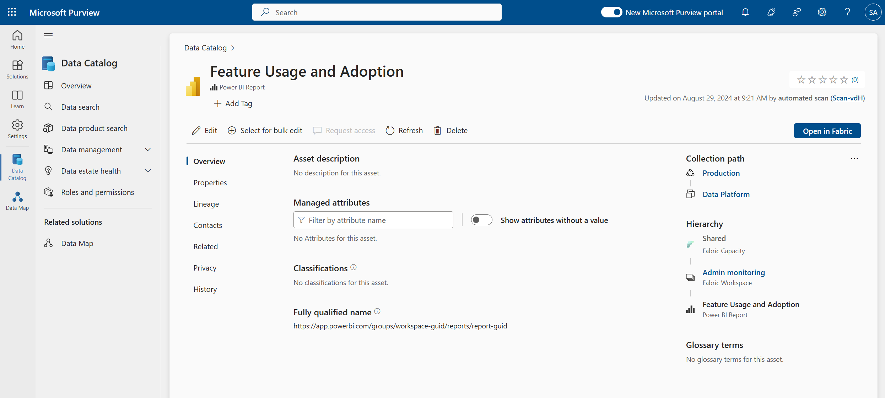

# Lab 5: Curating Data Assets

## Task 1: Curating Data Assets

> Microsoft Purview Solution: Data Catalog

**⏰ Duration:** 20 minutes

**🎯 Outcome:** At the end of this task, you will have curated a sample of data assets from scans configured in [Lab 3](/Lab-03.md). These will enriched with descriptions, tags, classifications, etc. thus, providing additional context for end users consumption and understanding.

### Introduction to Federated Data Curation

Data curation is the process of organizing and managing data assets to ensure their quality, accuracy, and reliability. It involves enriching the data for presentation by adding metadata, such as descriptions, tags, classifications, lineage information, etc. to make them more discoverable and usable by end users.

Because data is usually generated by all areas of a business, it is important to think about about the curation lifecycle before you start.

Traditionally, data governance curation was the responsibility of a central team, working down from the enterprise data model down, with the goal of representing the complete view of the organization’s processes and functions. This approach was slow, expensive, struggled to scale, and often didn't delivery the expected value. Microsoft's guidance is alter the approach, aligning to a [federated governance model](https://learn.microsoft.com/purview/what-is-data-catalog#:~:text=we%20believe%20in%20a%20federated%20governance%20approach%3A%20providing%20a%20centralized%20place%20to%20develop%20data%20safety%2C%20quality%2C%20and%20standards%2C%20but%20providing%20tools%20to%20create%20self%2Dservice%20access%20control%2C%20discoverability%2C%20and%20maintenance.), and empowering the business to take ownership of their data.

A Federated data governance approach spreads ownership across your business, reducing bottlenecks and encouraging participation in the life cycle of managing, governing, consuming, and applying data. It brings the business along on the journey, and empowers data experts to have ownership and responsibility for the data they know best.

#### Example of an Uncurated Data Asset

In the above example of a data asset, in this case a Power BI Report. Note how difficult it is to understand the purpose of the asset or what it represents - because it has not been described, tagged, or classified. This is a common problem in many organizations, and highlights why data curation is so important.

With basic curation, the asset can be transformed into something much more useful:

### Exercise: Curating Data Assets

**✍️ Do in Purview:** [15 minutes] Navigate to a data asset in the catalog (via search / filters) to expand its data asset overview page. Spend a minute to familiarize yourself with the page and, as a team, begin to 'Edit' (curate) the asset.

- Is the name of the asset meaningful to business users?
- Is the correct language and [taxonomy](https://learn.microsoft.com/azure/well-architected/security/data-classification#:~:text=taxonomy%20to%20assets.-,Taxonomy,-A%20system%20to) used?
- Can you add a rich text description to inform business users about the data asset and its potential use cases?
- Should the asset be certified, and thus considered reliable for use throughout the organization?
- Is the schema appropriately described?
- Are experts and owners assigned?
- Do we need to add any relevant tags to the asset to assist in its discovery?

**_NB_**: the Asset Ratings & Comment Feature available for each asset. Any Reader of the Data Catalog can contribute these ratings and comments. This is a great feature to engage the business, allowing them to provide feedback on the data assets. It is important not to confuse this metric with an asset's [data quality](https://learn.microsoft.com/purview/data-quality-overview), which we will cover in a [future lab](/Lab-08%20-%20Data%20Quality%20Management.md).

**🫂 Team Activity:** [5 minutes] As a team, discuss how you will position the rating/comment feature in Purview to your end users. What change management approach will you put out to drive catalog adoption and promote responsible use of asset ratings and comments?

**✨ Pro Tip:** Showcases, roadshows, lunch-learns, etc. backed by a strong communication strategy are great ways to raised awareness and create excitement for the new service, and drive its adoption.

At the end of the curation process, switch to the asset's History tab, and review the changes made to the asset. This is a great way to track changes made to the asset over time and understand who made them.

**✨ Pro Tip:** Use the 'Show details' button to compare changes made to the data asset.  
**✨ Pro Tip:** It may take several minutes for changes to be reflected in the History tab.

## Task 2: Browse and Discover Data Assets

> Microsoft Purview Solution: Data Catalog

**⏰ Duration:** 5 minutes

**🎯 Outcome:** At the end of this task, you have understood the Data Catalog's Data search experience.

### Exercise: Browsing and Discovering Data Assets

With several data assets now curated, it is time to browse and discover these in the Data Catalog. This will help us understand how they are organized and presented to end users.

**✍️ Do in Purview:** [5 minutes] Navigate to the Data Catalog and browse through the curated data assets by heading to **Data search**. Use the search bar to find assets by name, description, or tags. Use the filters to narrow down the search results by classification, glossary terms, and more.

**✨ Pro Tip:** You may see different assets to your colleagues based on your assigned roles and permissions at the Data Map collection into which the data source system scan indexed your assets, or the status of the Governance Domain to which the asset belongs.

---

**⏸️ Reflection:** Now that you have learned the basics of data asset curation, what are some of the challenges you foresee in getting business units to curate their data assets? How can you overcome these challenges?

👉 [Continue: Lab 6](./Lab-06%20-%20Data%20Products%20and%20Access.md)
