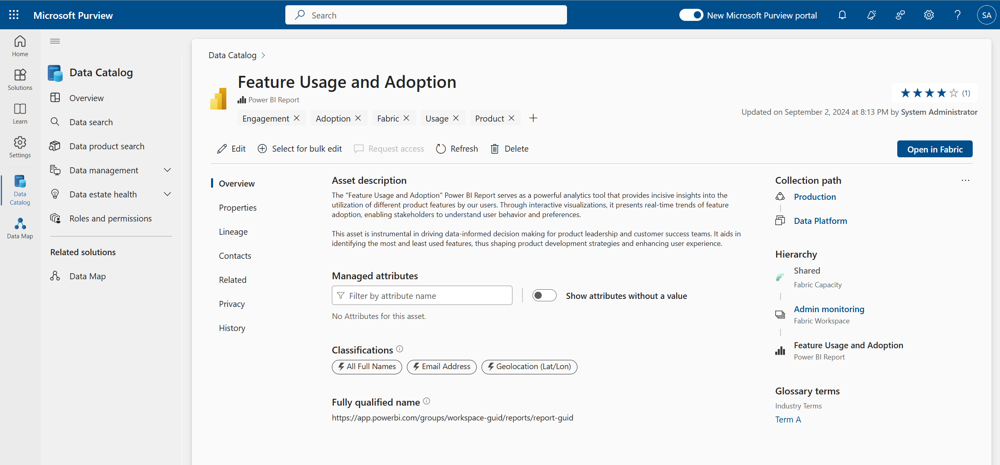
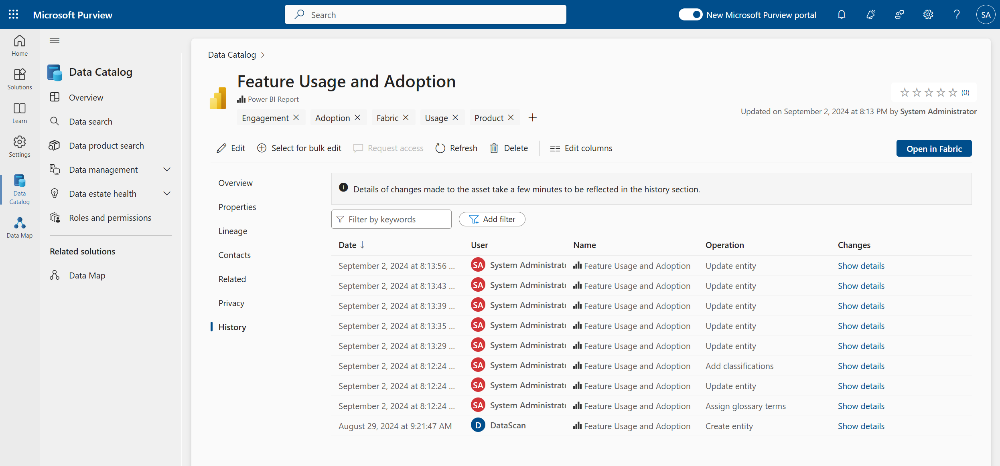

# Lab 5: Curating Data Assets

## Task 1: Curating Data Assets

> Microsoft Purview Solution: Data Catalog

**⏰ Duration:** 20 minutes

**🎯 Outcome:** At the end of this task, you will have curated data assets from scans configured in [Lab 3](/Lab-03.md) and make these discoverable with descriptions, tags, classifications, and more.

### Introduction to Federated Data Curation

Data curation is the process of organizing and managing data assets to ensure their quality, accuracy, and reliability. It involves adding metadata, such as descriptions, tags, classifications, and lineage information, to data assets to make them more discoverable and usable by business users.

Because data is usually generated by all areas of a business, it is important to think about about the curation process before you start. Naturally, your instinct will be to centrally curate all data assets as a central team - releasing them to the catalog as you go, this process will not scale, does not align with a federated governance model, and does not empower the business to take ownership of their data!

Instead, the best model is to bring business users along on the journey and let them (as the experts) be the curators of the data they know best and manage all day.

#### Example of an Uncurated Data Asset

In the above example of a data asset (a Power BI Report), note it is difficult to understand the purpose of the asset because it has not been described, tagged, or classified. This is a common problem in many organizations, and highlights why data curation is so important.

With basic curation, the asset can be transformed into something much more useful:

### Exercise: Curating Data Assets

**✍️ Do in Purview:** [15 minutes] Navigate to a data asset in the catalog (via search / filters) to expand its data asset overview page. Spend a minute to familiarize yourself with the page and, as a team, begin to 'Edit' (curate) the asset.

- Is the name of the asset meaningful to business users?
- Can you add a rich text description to inform business users about the data asset and its potential use cases?
- Should the asset be certified and thus deemed reliable for use throughout the organization?
- Is the schema appropriately described?
- Are experts and owners assigned?
- Do we need to add any relevant tags to the asset to assist in its discovery?

Note the Asset Ratings & Comment Feature available for each asset. Any Reader of the Data Catalog can contribute these ratings and comments. This is a great feature to engage the business by allowing them to provide feedback on the data assets. It is important not to confuse this metric with an asset's data quality, which we will cover in a [future lab](/Lab-08%20-%20Data%20Quality%20Management.md).

**🫂 Team Activity:** [5 minutes] As a team, discuss how you will position the rating/comment feature in Purview to your business users. What correspondence will you put out to drive catalog adoption and promote responsible use of asset ratings and comments?

At the end of the curation process, switch to the asset's History tab, and review the changes made to the asset. This is a great way to track changes made to the asset over time and understand who made them.

**✨ Pro Tip:** Use the 'Show details' button to compare changes made to the data asset.  
**✨ Pro Tip:** It may take several minutes for changes to be reflected in the History tab.

---

**⏸️ Reflection:** Now that you have learned the basics of data asset curation, what are some of the challenges you foresee in getting business units to curate their data assets? How can you overcome these challenges?

👉 [Continue: Lab 6](./Lab-06%20-%20Data%20Products%20and%20Access.md)
