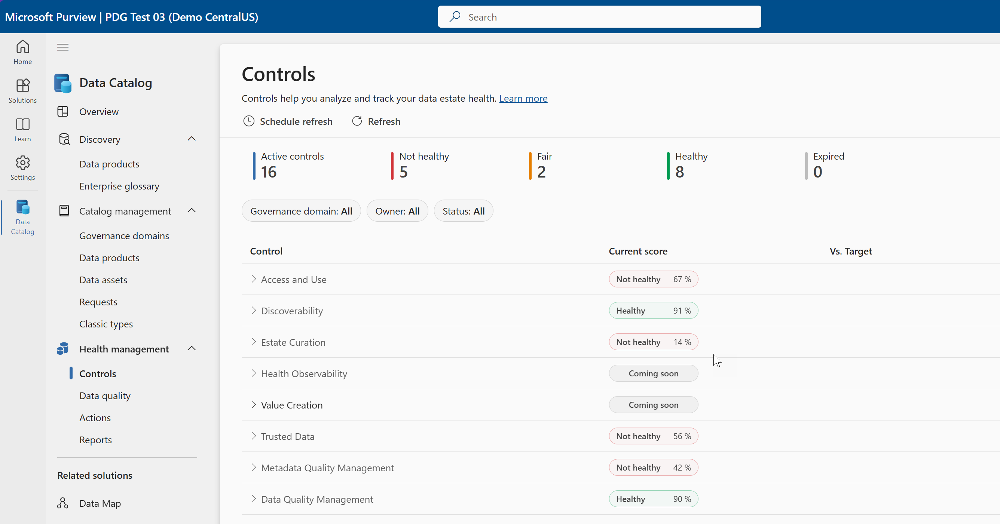
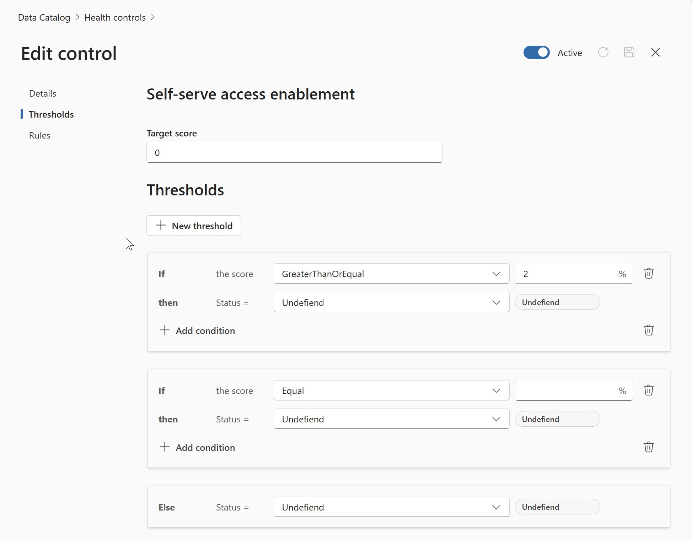
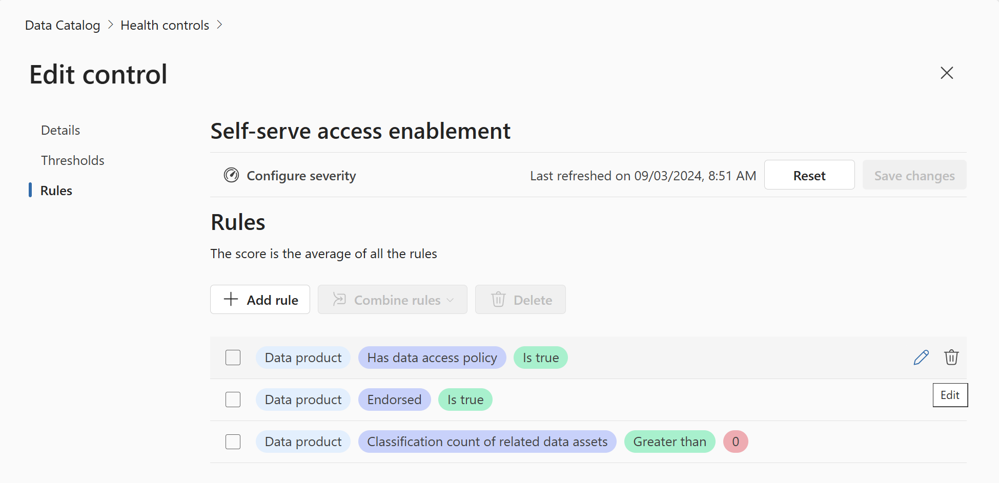
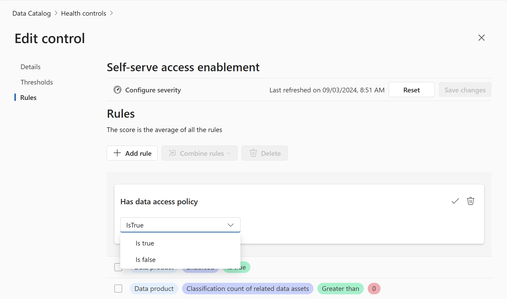
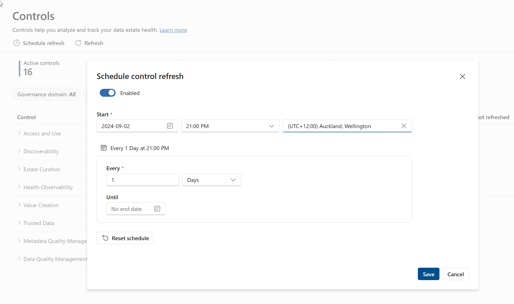

# Lab 8: Health Management Overview

**⏰ Duration:** 30 minutes

**🎯 Outcome:** At the end of this task you will understand the importance of data estate health and the tools provided by Purview to manage and maintain these.

## Introduction

Data estate health is the degree to which an organization's data assets are accurate, consistent, complete, accessible, secure, and compliant with business rules and regulations. Data estate health is a key factor for ensuring data quality, trust, and value for the organisation, across the data lifecycle.

In the age of AI, particular with [non-deterministic](https://techcommunity.microsoft.com/t5/ai-ai-platform-blog/the-future-of-ai-the-paradigm-shifts-in-generative-ai-operations/ba-p/4254216#:~:text=However%2C%20generative%20AI%20introduces%20non%2Ddeterministic%20outputs) systems, it is imperative that we have accurate information about the health of our data to ensure that our models can provide the actionable insights grounded on reliable and trustworthy data. The Data truism of 'garbage in, garbage out' has never been more relevant.

While organizations understand the need to have healthy data and the key requirements for achieving data health, it is rare to find strong practices consistently implemented to deliver this.

The purpose of Purview's [Health Management](https://learn.microsoft.com/en-us/purview/data-estate-health) capability is to provide customers with the tools they need to evaluate, take action, and report upon the health of their data. Given that data estates are growing rapidly managing the data itself is challenging enough, staying on top of data health often becomes a secondary objective.

Purview's Data Health Management capability has four components:

- **Controls**: [Controls](https://learn.microsoft.com/purview/data-estate-health#controls) are a metric-based rules set at the global level, executed at the grain of the Governance domains. This enables the evaluation and audit of data health, aligned to industry and enterprise recognized standards.
- **Data Quality**: A set of [configurable processes](https://learn.microsoft.com/purview/data-quality-overview#data-quality-features) which can provide data profiling, data quality scanning and scoring technical metadata, along with alerting into the Data Catalog.
- **Actions**: Providing [actionable insight](https://learn.microsoft.com/purview/data-estate-health-actions#available-actions) and notifications for steps you can take to improve data health and governance across your data estate.
- **Reports**: A set of [out-of-box](https://learn.microsoft.com/purview/data-health-reports#currently-available-reports) reporting supporting deeper analysis on the health of your data estate.

By having this toolset available, focus can be placed on the need to have a more proactive and dedicated approach to improving data health and influencing decisions to actively improve it.

## Task 1: Understand the Health Management Controls

> Microsoft Purview Solution: Data Catalog

**⏰ Duration:** 15 minutes

**🎯 Outcome:** At the end of this task you will understand the 8 key pillars for data estate health. In Purview these can be considered the health [control groupings](https://learn.microsoft.com/purview/how-to-health-controls#:~:text=Expand%20table-,Control%20grouping,-Control). All individual controls fall into one of these groups.

### What are the Key Pillars for Data Estate Health?

With Health controls you can define and measure the vital signs of your data estate across the eight key pillars of data estate health:

- **Access and use**: Do we have the right policies and procedures in place to facilitate access and compliant use of data? i.e. Do we have self-service data access policies in place? Are users declaring the intended use of the data?
- **Discoverability**: Are we enabling users to find the data they need? To what extent have we made data products available to our users with relevant data assets mapped?
- **Estate Curation**: Are data products suitably classified and labelled?
- **Health Observability**: Do we have the right tools in place to monitor the health of our data estate? Are they consistently used to drive better outcomes?
- **Value Creation**: Are data products aligned to business outcomes?
- **Trusted Data**: Do we know who owns the data? Has it been certified and quality checked?
- **Metadata Quality Management**: How well are the data products and assets described?
- **Data Quality Management**: What is the quality of our data in terms of accuracy, completeness, conformity, uniqueness, consistency and timeliness?

### Exercise: Review the Health Controls Dashboard

**🫂 Team Activity:** [15 minutes] Review the [available health controls](https://learn.microsoft.com/en-us/purview/how-to-health-controls) and discuss the importance of each of health control within your organization.

**✍️ Do in Purview:** [15 minutes] Using the Health controls tool, navigate to the Health Controls dashboard and review the health controls available.

Here you will see a summary of the Health Controls and the number of Controls that are in place. Initially there will not be any current scores displayed as these are calculated based on the current state Controls. Once the Controls are in place and the rules are defined, the scores will be calculated and displayed.

- **Active controls**: The number of controls that are currently in place.
- **Not Healthy**: The number of controls which are considered not healthy based on the health status rules that have been defined.
- **Fair**: The number of controls which are considered fair based on the health status rules that have been defined.
- **Healthy**: The number of controls which are considered healthy based on the health status rules that have been defined.
- **Expired**: A Control can expired when it is not being evaluated or is no longer needed because it is always green, which would be rare.
  - The control can be set to 'not active' which will expire it. This happens in the Health Control edit panel by flipping the active switch at the top. 
    **_NB_** - This requires at least [Data Health owner](https://learn.microsoft.com/purview/governance-roles-permissions#:~:text=Data%20catalog-,Data%20health%20owner,-Create%2C%20update%2C%20and) permissions.

Clicking on the arrow next to a Control Group, expands the list of Controls within that group. Click on a Control Name to view the details of the Control. This will show you a graph of the recent score, control description, health status, the linked governance domain, the target value and when the control was created.

**✨ Pro Tip:** The Health controls dashboard allows you to view your data estate health at a glance as a grid, a tree view or a chart view. You can also filter the controls by health status, Governance domain, owner or keyword.

---

## Task 2: Updating Health Controls and thresholds

> Microsoft Purview Solution: Data Catalog Health Controls

**⏰ Duration:** 15 minutes

**🎯 Outcome:** At the end of this tasks, you will have updated the properties of a Health Control.

### Exercise: Edit health control properties

**✍️ Do in Purview:** [10 minutes]

1. Using either the tree view or grid view, select a Health Control and click on the Edit button. (The edit button is the pencil icon). This will bring you to the Edit control window for the specific control.

   

2. On the Details tab, update the owner of the control.

3. Update the description of the control.

4. Select the Governance domain that the control is applicable to.

5. Decide if the control is active or not.

### Exercise: Update Thresholds

**✍️ Do in Purview:** [15 minutes]

The thresholds tab enables you to configure how the health status will be displayed on the Health Controls Dashboard.

1. While in the Edit control window, click on the Thresholds tab. This will show you the thresholds that are in place for the control. Thresholds are configured at the individual control level.
   

2. Click on the New threshold button, which will add an if-then statement where you can configure the condition for one of the following statuses:

- Healthy
- Fair
- Not healthy
- Critical
- Undefined

3. Configure the threshold by selecting the:

- condition,
- the operator and;
- the target value.

4. Click on the save icon to save your control changes and close the window.

## Task 3: Health Control Rules

> Microsoft Purview Solution: Data Catalog Health Management

**⏰ Duration:** 15 minutes

**🎯 Outcome:** At the end of this task you will understand how to configure Health Control rules.

Health Control rules measure the performance of each of your controls.

### Exercise: Review Health Control Rules

**✍️ Do in Purview:** [15 minutes]

Click on the Rules tab in the Edit control window to view the rules that are in place for the control.

The example shown in this screenshot is a rule for "Self-serve access enablement". This rule is defined as follows:

- **Scope**: The scope to which this rule should apply. In this case it applies to the Data product scope. The scope is determined by the type of rule that is being defined. (Highlighted in light blue)
- **Rule name**: The name of the rule. In this case the last rule is "Classification count of related data assets". (Highlighted in light purple)
- **Comparison operator**: When a comparison operator is relevant, it is defined here. In this case the comparison operator is "Greater than" (Highlighted in light green). Not all rules have comparison operators as in some cases it can be a binary rule.
- **Value**: The target value that the rule is compared against. In this case the value is 0. This means that the rule will be considered healthy if the number of published terms of use is greater than 0.

**🫂 Team Activity:** [15 minutes] Review the other rules available and discuss the importance of each of these rules within your organization. Consider the relevance and target values of each rule in your discussion.

**Permission Requirement:** To update and manage the control rules, you need to have the Data Health Owner permissions assigned to you.

### Exercise: Update and Create Health Control Rules

> Microsoft Purview Solution: Data Catalog

**⏰ Duration:** 25 minutes

**🎯 Outcome:** At the end of this exercise, you will:

- Have updated the logic of an existing Health Control rule.
- Created a new Health Control rule.
- Combined two Health Control rules.
- Updated the severity of a Health Control rule.

**✍️ Do in Purview:**

#### Update an existing Control rule

Following on from the previous exercise, we will now edit one of the control rules.

1. Click on the Edit button (the pencil icon) which becomes visible when you hover over the rule.
    This will open the editable settings for the specific rule.

2. Select the relevant comparison operator and target value for the rule, if applicable. In this example the rule is binary, and the only valid options are 'Is true' or 'Is false'.
   

3. Click on the check mark button to accept the changes to the rule.

4. Click on the Save changed button to save the changes to the rule.

---

#### Create a new Health control rule

Continuing on from the previous exercise, we will now add an additional rule to the Self-service access enablement control.

1. Click on the Add rule button, which will open a list of all available rules that can be added to the control.
   

2. Scroll through the list of available rules and select the rule that you want to add to the control. Click on the OK button to add the rule.

3. Configure the rule by selecting the operator and the target value.

4. Click on the check mark button to accept the changes.
5. Click on the Save changes button to save the changes to the rule.

**✨ Pro tip:** Control rules can be combined using the logical operators AND/OR after rule creation to create complex rules that are relevant to your organization.

Combine two rules by checking the checkbox next to the rule and clicking on the "Combine rules" button. This will allow you to select the logical operator that you want to use to combine the rules.

---

#### Update the severity of a Health Control Rule

1. Click on the Configure severity button to open the severity configuration window.
   
   This will open the severity configuration window.

2. Click on the control for which you want to configure the severity of the rules and select the severity level that you want to assign to the rule.

- Low
- Medium
- High

  

3. Click on the Save button to save the changes to the severity level of the rule.

---

### Exercise: Schedule Control Refresh

**✍️ Do in Purview:**
[10 minutes] Schedule Control refresh.

Microsoft Purview can automatically refresh the health status of your controls on a schedule that you define. This allows you to keep your health status up to date.

1. Schedule control refreshes by clicking on the Schedule refresh button at the top of the health controls screen.

2. Select:
   - The start date and time for the refresh.
   - The desired time zone.
   - The frequency of the refresh (daily, weekly, monthly).

Here is an example of a daily refresh schedule:

**⏸️ Wait:** Wait for the control refresh to save/run and check the health control dashboard to see the updated health status of the control.

---

**⏸️ Reflection:** The health control rules are a powerful tool to define how the quality of your data estate should be measured. How do you think you can use these rules to improve the quality of your data estate?

👉 [Continue: Lab 9](./Lab-09%20-%20Data%20Quality%20Management.md)
