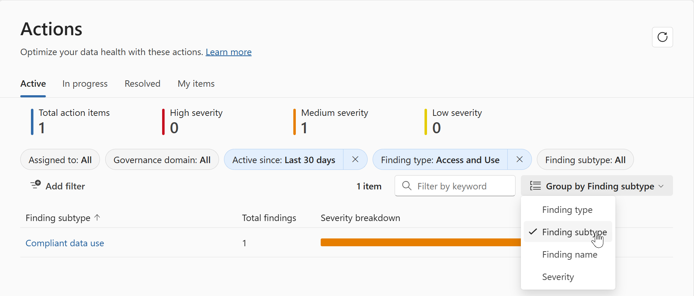

# Lab 10: Data Estate Health Actions

**⏰ Duration:** 30 minutes

**🎯 Outcome:** At the end of this lab you will understand how to use Data Estate Health Actions to improve the overall health score of your data estate.

## Introduction

In the section on Health Management Controls and Data Quality Management, we looked at how to configure the rules that determine the quality score of each of your health controls. In this section we will focus on the Data Estate Health Actions in Purview and how to use it to improve the overall health score of your data estate.

The data estate health actions tool in Purview allows you to define and track the actions that need to be taken to improve the health of your data estate. These actions can be assigned to individuals or teams and tracked to completion.

**Permission Requirement:**

- You need Data Health Reader permissions to be able to view Health Management Actions.
- You need Data Health Owner permissions to be able to update Health Management Actions.

## Task 1: Understand the Health Management Dashboard

> Microsoft Purview Solution: Data Data Catalog

**⏰ Duration:** 15 minutes

**🎯 Outcome:** At the end of this task you will understand how to use the health action tool to address the findings of the health control rules and improve data estate health by managing the steps required to complete the health actions.

### How are health actions determined?

Health actions are created when the health control rules are not met. Based on each specific health control rule, a health action is created to address the issue. The severity of the health action is determined by the severity of the health control rule as configured in the severity configuration as discussed in the previous lab.

### The Health Actions Dashboard

The Health actions dashboard gives you an overview of the health actions that have been created based on the health control rules that have been defined. By default health actions are assigned not assigned to anyone and needs to be assigned to a user to be actioned.

The Health Actions Dashboard shows 4 tabs:

- Active: This shows new actions and actions which are currently in progress.
- In Progress: A list of actions of which the status has been changed to in progress.
- Resolved: A list of actions that have been resolved.
- My Items: Items assigned to you.

**✍️ Do in Purview:** [15 minutes] Using the Health actions tool, review the active health actions, assign an action to a user and set the status of an action to in progress.

Health actions can be filtered by the following criteria:

- Assigned user
- Governance domain
- Severity
- Days its been open
- Finding type, name and subtype
- Target entity type ie. Governance domain , data product, data asset etc.

1. Click on the Active tab to view the active health actions. This may vary slightly depending on how the findings are grouped. In this case the findings are grouped by finding type.
2. To change the grouping of the findings click on the Group by dropdown and select the grouping you would like to use. 

3. To view the details of an action click on one of the findings in the list.This will bring up the Finding screen which shows the details of the finding.
   
4. Assign the health action to a user by clicking in the Assigned to field and selecting a user from the list.
5. Set the status of the health action to in progress by clicking on the status field and selecting "in progress" from the list of options. This is typically not an action you would do if you are assigning the action to someone else, as the person assigned to the action would be responsible for updating the status.
6. Click on the Save button to complete the assignment and status update.

**✨ Pro Tip:** Actions that have been marked as Resolved will be reconciled when the next scan runs. If an action has incorrectly marked as resolved or not correctly mitigated the action will be reset to active.

---

**⏸️ Reflection:** You just learnt how to use the Health Actions tool to manage the actions required to improve the health of your data estate. Now let's have a word about Business Continuity and Disaster Recovery.

👉 [Continue: Lab 12](./Lab-12%20-%20Business%20Continuity.md)
