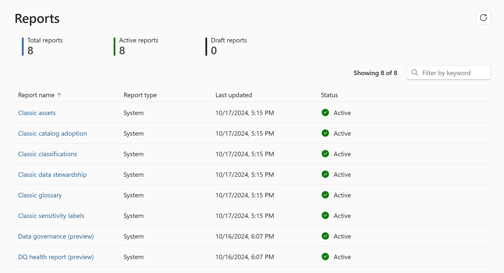
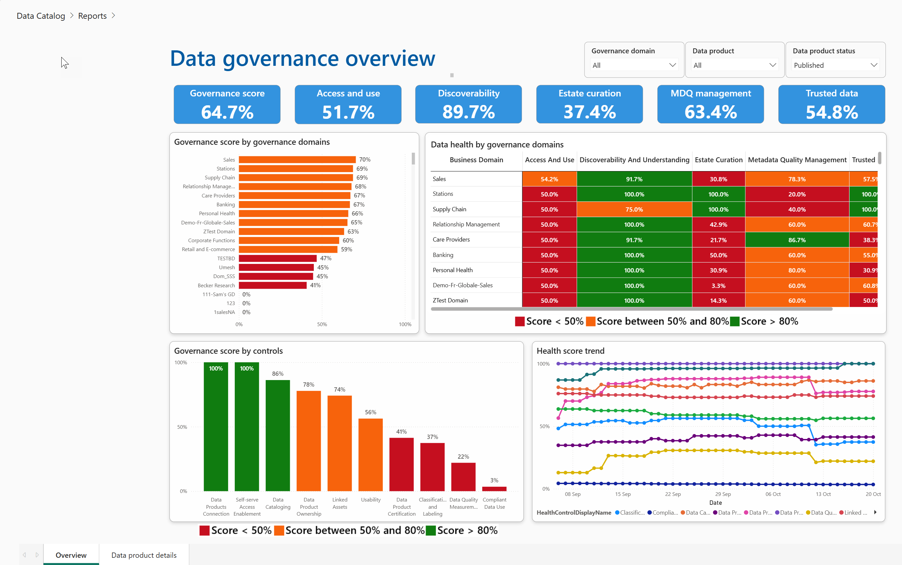
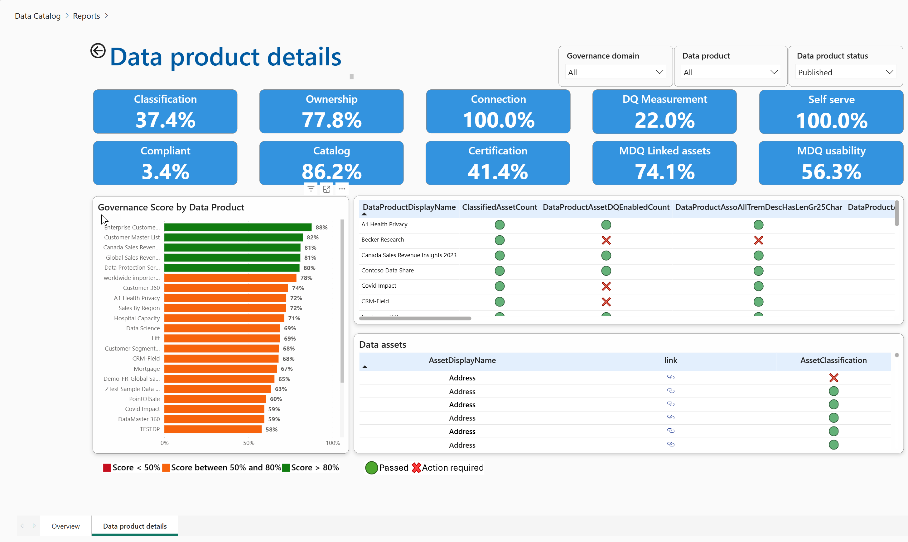
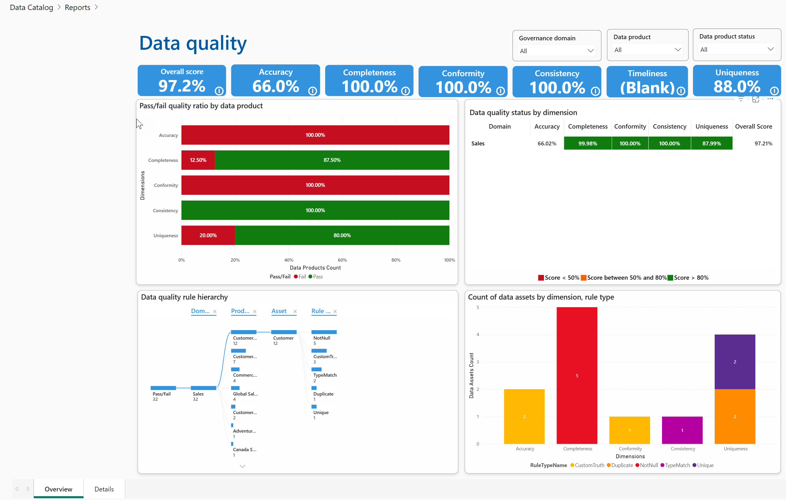
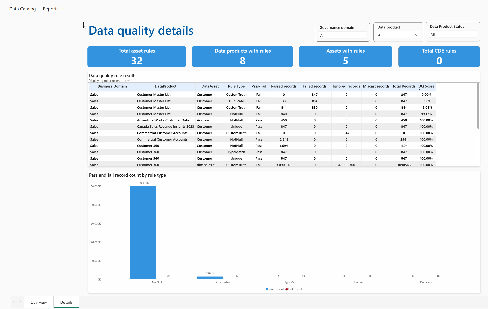

# Lab 11: Health Management Reports

**⏰ Duration:** 30 minutes

**🎯 Outcome:** At the end of this lab you will understand which reports are available out of the box and how to use them to improve the overall quality of your data estate. 

## Introduction

 Let's delve into the built-in reports provided by Purview to monitor and manage your data's health, ensuring its quality, compliance, and usability. These reports are essential for maintaining a healthy data estate and are crucial for making informed decisions about your data governance strategy.

**Permission Requirement:**

- You need at least [Data Health Reader](https://learn.microsoft.com/purview/governance-roles-permissions#governance-domain-level-permission:~:text=read%2C%20datahealth/write-,Data%20health%20reader,-Can%20read%20artifacts) permissions to be able to view Health Management Reports.

## Task 1: Exploring Data Health Reports

> Microsoft Purview Solution: Data Catalog

**⏰ Duration:** 15 minutes

**🎯 Outcome:** Gain familiarity with the various health reports available in Purview.

### Know which reports are available and what they are used for.

There are currently 8 out of the box reports available in Purview:
Of these 8 reports, 6 are legacy reports which have been prefixed with the word "Classic" to indicate that they are being deprecated in favor of the new reports. Two new reports are currently in preview and are postfixed with the word "Preview".

The reports are as follows:
- Classic assets
The Classic assets report provides an aggregated view of the assets in your data estate. It includes the number of assets(total, new , deleted), the number of assets with classifications, and the number of assets with sensitivity labels grouped by collection or source type. Drill-through capabilities are available to view the details of the assets.

- Classic catalog adoption
The purpose of the Classic Catalog Adoption Report in Microsoft Purview is to provide administrators with insights into the usage and adoption of the Microsoft Purview Data Catalog, helping them understand user activity, search behavior, feature utilization, and asset engagement.

- Classic classifications
This report helps identify and track the types of data classified within the data estate, such as financial or government data, and shows trends over time. It includes information on the number of classified sources, files, and tables, as well as the top classifications applied accross the datamap. 

- Classic data stewardship
The purpose of the Data Stewardship Report in Microsoft Purview is to provide administrators with insights into the activities and effectiveness of data stewards within their organization. This report tracks the actions taken by data stewards, such as data classification, curation, completeness of the meta data.

- Classic glossary
This report includes key performance indicators such as the total number of terms, the status of terms (e.g., draft, approved, expired), and the distribution of roles by users. It helps administrators understand the completeness of glossary terms by highlighting missing information, such as definitions, experts, or stewards, and provides a detailed view of terms attached to assets, aiding in effective data governance and management. This only takes into consideration the terms that are part of the classic glossary.

- Classic sensitivity labels
This report tracks the number of labeled items, the types of sensitivity labels applied, and the trends over time. It helps administrators understand how data is being classified in terms of sensitivity, ensuring that sensitive information is properly protected and compliance requirements are met.

- Data governance (preview)
The new Data Governance Report in Microsoft Purview provides a data governance overview with insights into the health of your data estate based on the controls configured for:  
   - Access and use
   - Discoverability
   - Estate curation
   - MD quality management
   - Trusted data

   as well as deeper dive into the health of your data at from a  data product perspective looking at percentages of data products which have classifications, data assets, self-service access ,policies and glossary terms, owners and descriptions attached.

- DQ health report (preview)
The new Data Quality Health Report in Microsoft Purview provides insights into the health of your data estate based on the data quality rules configured for your data estate. 

   The overview page shows a quick snapshot of the Overall score, the accusracy, completeness, conformity, uniqueness, consistency and timeliness and uniqueness scores. The Details page provides a more detailed view of the data quality rule results and the data assets that are failing the rules.

## Task 2: Interpreting the Data Governance Report
**⏰ Duration:** 30 minutes

**🎯 Outcome:** At the end of this session you would be able to effectively analyze and understand the key metrics and insights provided in the Data Governance Report. This includes learning how to assess data curation status, track data ownership, identify trends, and derive actionable insights to enhance data governance and quality.

### Understand the key metrics and insights provided in the Data Governance Report Overview

The metrics at the top of the page provide a snapshot of the health of your data estate based on the controls configured for Access and Use, Discoverability, Estate Curation, MD Quality Management, and Trusted Data.

This can be filtered by the following:
- Governance Domain
- Data Product
- Data Product Status (Pblished or Draft)
- Control (by clicking on the control in the charts)

The metrics will reflect the average of the control scores for the selected dimension. 

Unline the other metrics, estate curation is not an average of the control scores but rather a calculated score based on the number of data assets that have classicifation applied. 

You are able to track your progress over time using the health score trend chart. 

### Understand the key metrics and insights provided in the Data Governance Report Details

The Data products details page allows you to see the how well a specific data product is doing in terms of the controls configured and details about which checks have failed. 

Understanding which check have failed will allow you to take action to improve the health of your data estate.

## Task 3: Utilizing Data Quality Health Report
**⏰ Duration:** 30 minutes

**🎯 Outcome:**  At the end of this session you would be able to effectively use the Data Quality Health Report to monitor and improve data quality. 

### Understand the key metrics and insights provided in the Data Quality Health Report Overview

The Data Quality Health Report Overview page provides a snapshot of the health of your data estate based on the data quality rules configured for your data estate. At a glance you will be able to see the Overall score, the accusracy, completeness, conformity, uniqueness, consistency and timeliness and uniqueness scores.

The data quality health report overview page contains the 4 visuals: 
- Pass/fail quality ration by data product
- Data quality status by dimension
- Data quality rule hierarchy
- Count of data assets by data assets, rute type

### Understand the key metrics and insights provided in the Data Quality Health Report Details

The Data Quality Health Report Details page provides a more detailed view of the data quality rule results including how many rows have failed the rule, the percentage of rows that have failed the rule and the data assets that are failing the rules.

**⏸️ Reflection:** 
- How have these reports improved your understanding of your data's health?

- What new insights have you gained from analyzing these reports?

- How can you leverage these reports to enhance your data governance practices?

👉 [Continue: Lab 12](./Lab-12%20-%20Business%20Continuity.md)
