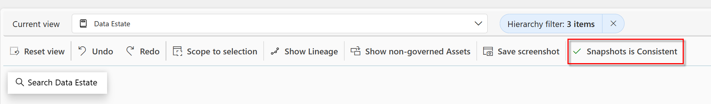

# Lab 12: Data Observability

**⏰ Duration:** 30 minutes

**🎯 Outcome:** At the end of this lab you will understand the purpose and use of Observability in Purview Unified Catalog
## Introduction

Purview data observability in the Microsoft Purview Unified Catalog provides a holistic, visual overview of your data estate’s health, lineage, and quality. It enables data stewards and governance teams to:

View the lineage of data assets across domains.
Monitor data quality and health in a single dashboard.
Quickly identify issues, gaps, or reporting obligations.
Drill into metadata to understand how data is used, by whom, and where improvements are needed.
The Observability tab appears on governance domains, data products, and glossary terms, and a dedicated page under Health Management gives a custom view of the entire estate.

**Permission Requirement:**

- Using Data Observability will require users to have a role accountable for data governance (Governance Domain Owner, Data Steward or Data Product Owner). 

## Task 1: Setup Data Observability

> Microsoft Purview Solution: Unified Catalog

**⏰ Duration:** 10 minutes

**🎯 Outcome:** Data observability scanning has been enabled by the Data Governance administrator.

### Enable Catalog and Data Quality snapshot jobs.

Data observability captures scheduled snapshots of the catalog and data quality metadata to enable fast rendering of diagrams. This snapshot acts as a performance cache and must be enabled by the Data Governance administrator. Without it, rendering large diagrams with extensive lineage and metadata could take significantly longer.

Once turned on , the catalog snapshot is taken every 4 hours and the Data Quality snapshot every 10 minutes. 

To turn this on: 
- Sign in to the Microsoft Purview portal using credentials for a Data Governance admin role.
- Go to Settings, then select Unified Catalog.
- Select Data Observability.
- Select Enable next to the Catalog Snapshot Job heading.
- Select Enable next to the Data Quality Snapshot Job heading.

## Task 2: Explore Observability in Health Management
**⏰ Duration:** 40 minutes

**🎯 Outcome:** At the end of this task, you will be able to understand how data observability enhances visibility, trust, and governance across complex data ecosystems.

You will be able to:

- Explain the concept of data observability and its role in data governance.
- Navigate Microsoft Purview’s observability in Health Management.
- Interpret lineage diagrams and data quality indicators to assess the health of data assets.

### The role of data observability in data governance

Data observability plays a critical role in data governance by providing deep visibility into the health, lineage, and quality of data across an organization’s ecosystem. It enables data stewards, architects, and analysts to monitor how data flows between systems, identify where issues arise, and understand the impact of those issues on downstream processes. By surfacing metadata, lineage, and quality metrics, observability helps ensure that data remains trustworthy, compliant, and fit for purpose. This transparency empowers teams to make informed decisions, enforce governance policies, and respond quickly to anomalies—ultimately strengthening the organization’s ability to manage data as a strategic asset.

### Data observability in Health management

Data Observability in health management provides a holistic, cross-domain perspective of the entire data estate in a single pane of class. 

Note the coloured lines under the Governance domain or Dataproducts. This gives a quick indication of the data quality of the domain or data product highlighting any potential issues without having to look any further. 

To see more information about the quality of a Governance domain , Data product or asset you can double click on the relevant item. 

The below screenshot is the result of double-clicking on a Data product within the Sales Governance domain. 

The side panel brings up detailed information about the specific item, in this case the Data product which lists: 

- Data product information
- Data quality dimensions
- Glossary terms and descriptions
- Assets

The Data Estate View can be quite busy. To simplify the view, select the item you are interested in , for example the Data product and click on the Scope to Selection button to focus the view on the item that you are interested in. 

When selecting a Data product or a Data asset , you will be able to look at lineage if lineage has been captured. You can do so by first selecting the item for which you wish to see lineage (highlighting it in blue) , and then clicking on the Show Lineage button. 
This will show the lineage between the assets connected to the data product. 

In this case the selected data product has lineage to assets which are as of yet ungoverned. To remove ungoverned assets from the view, click on the Hide non-governed assets button. 

The **hierarchy filter** allows you to see details of your estate at different hierarchy levels. The levels are: 
- Governance domains
- Data products
- Assets 
- Asset Schema

Use the Reset View button to go back to full view of the entire estate. 

### Observability Data Estate Search
The Search data estate function allows you to search through all the governance concepts and assets in your estate and add one or more to the observability canvas for futher inspection. 

- Start by typing the name of any concept or asset in the search box.
- Find the relevant item in the drop down (Different types of items are indicated by different icons)

- Clicking on an item will display the details of this time in the search window. 
- Upon reviewing that this is the item you are after you can select either Add to Diagram or Add to Diagram(with lineage). When adding with lineage , it will go directly to the lineage view. If you add without linegage you will still be able to display the lineage by clikcing on the show lineage button. 
- Click add to add the asset to the canvas.
- Repeat for all the assets you would like to view together. 

## Task 3: Explore Concept Specific Obervability views.

**⏰ Duration:** 20 minutes

**🎯 Outcome:** At the end of this task, you will be able to use concept specific observability view to explore the quality of your Governance domains, Data Products and Terms

You will be able to:

- Navigate Microsoft Purview’s observability infeatures including domain, product and glossary views.

### The Governance Domain Observability view
**The Governance Domain Observability view ** provides a high-level overview of data health across a specific governance domain. 

This view can be accessed by clicking on the Data Observability tab within the Data Governance domain. 

The following views are available to help the Governance domain owner better understand the quality of their domain. 

- Data Products/ Assets
- Data Products
- Assets
- Data Products Lineage View
- Assets Lineage view
- Data Assets with Data Quality Issues
- Data Products with Data quality issues

Selecting the Data Assets with Data Quality issues view, quickly highlights any assets within the domain which requires attention. Again double-clicking on any item will bring up the side panel with detailed information about the item in question. 

### Data Product Observability View
The data product observability view focuses on a single data product and its associated assets. It shows:

- All assets within the product
- Assets with data quality issues

This view is useful for product owners or data stewards to monitor the health of their specific data products.

To get to the Data Product Observability:

Navigate to the Data product in the Catalog Management section and click on the Data observability tab.

**Good to know:** The observability feature itself does not create lineage, instead it leverages the lineage created when the data is scanned or lineage it manually created. 

**✨ Pro Tip:** If you are not seeing any information in observability, ensure that Observability has been enabled in settings as shown in task 1 and wait 4 hours. 
The indicator at the top right of the screen will show that the snaptshot it consistent. 

---

**⏸️ Reflection:** 
This lab introduced Microsoft Purview data observability and how it provides visibility into the health, lineage, and quality of your data estate. It showed how to enable Catalog and Data Quality snapshot jobs, navigate the Observability views in Health Management, interpret lineage diagrams and data quality indicators, and use UI controls such as Scope to Selection, Show Lineage, Hide non‑governed assets, hierarchy filters, and Reset View. The lab also covered concept-specific views for governance domains and data products, and highlighted permission requirements and the importance of snapshot consistency.
👉 [Continue: Lab 13](./Lab-13%20-%20Business%20Continuity.md)
