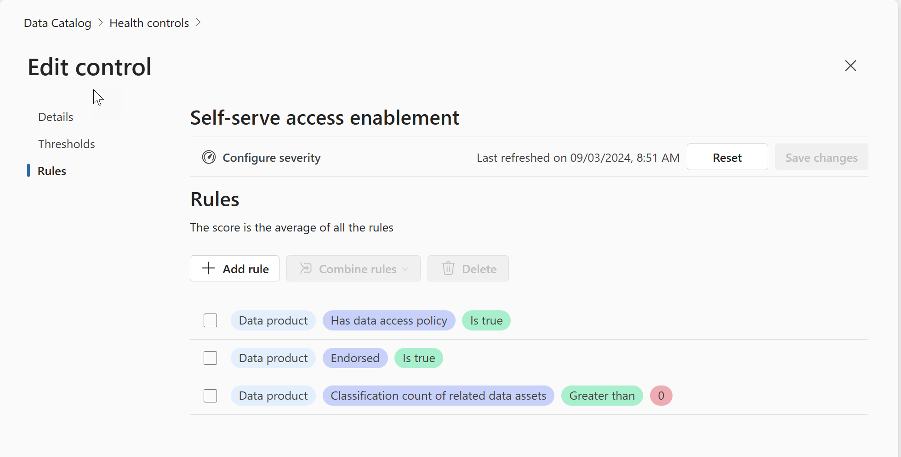

# Lab X: Metadata Quality
**⏰ Duration:** 30 minutes

**🎯 Outcome:** At the end of this task you will understand the purpose and usage of the Metadata quality experience in Microsoft Purview Data Catalog.  

## Introduction
In the previous section we discussed the importance of data estate health and the tools provided by Purview to manage data estate health. In this section we will focus on the Metadata quality experience in Purview and how to use it to configure the rules that determine the quality score of each of your health controls. 

## Task 1: Understand the predefined logic for each of the metadata quality rules 

> Microsoft Purview Solution: Data Data Catalog 

**⏰ Duration:** 15 minutes

**🎯 Outcome:** At the end of this task you will have reviewed the predefined metadata quality rules.

### Exercise: Review Meta Data Quality Rules

**✍️ Do in Purview:** [15 minutes] 

Using the Metadata quality tool, click on the first control group "Access and Use" and review the metadata quality rules that are in place for each of the controls.

The first rule, as shown in this screenshot is the rule for "Compliant data use". This rule is defined as follows: 

- Scope: The scope to which this rule should apply. In this case it applies to the Data product scope. The scope is determined by the type of rule that is being defined.
- Rule name: The name of the rule. In this case the rule is "Published terms of use count".
- Comparison operator: When a comparison operator is relevant, it is defined here. In this case the comparison operator is "Greater than". Not all rules have comparison operators as in some cases it can be a binary rule.
- Value: The target value that the rule is compared against. In this case the value is 0. This means that the rule will be considered healthy if the number of published terms of use is greater than 0.

**🫂 Team Activity:** [15 minutes] Review the other rules available and discuss the importance of each of these rules within your organization. Consider the relevance and target values of each rule in your discussion. 

**Permission Requirement:** To update and manage the metadata quality rules you need to have the data health owner permissions assigned to you.

## Task 2: Update and Create Metadata Quality Rules

> Microsoft Purview Solution: Data Catalog Metadata Quality

**⏰ Duration:** 25 minutes

**🎯 Outcome:** At the end of this excercise, you will have updated the logic of an existing Metadata quality rule and created a new metadata quality rule

### Exercise: Update and create Metadata Quality Rules

**✍️ Do in Purview:**  [10 minutes]  

Update and existing Metadata quality rule
1. Click on the health control for which you want to update the metadata quality rule.

2. Click on the Edit button (the pencil icon) which becomes visible when you hover over the rule. This will open the editable settings for the specific rule.
   

3. Select the relevant comparison operator and target value for the rule.

4. Click on the check mark button to save the changes to the rule.

**✍️ Do in Purview:** [15 minutes] Create a new Metadata quality rule

1. Click on the health control for which you want to add a new metadata quality rule.

2. Click on the Add rule button, which will open a list of all available rules that can be added to the control. 
   

3. Scroll through the list of available rules and select the rule that you want to add to the control. Click on the OK button to add the rule.

4. Configure the rule by selecting the operator and the target value. 

5. Click on the check mark button to save your new rule.

**✨ Pro tip:** Metadata quality rules can be combined using the logal operators AND/OR after rule creation to create complex rules that are relevant to your organization. 

Combine two rules by checking the checkbox next to the rule and clicking on the "Combine rules" button. This will allow you to select the logical operator that you want to use to combine the rules.
   

**✍️ Do in Purview:** [15 minutes] Configure the severity of the rules
1. Click on the Configure severity button to open the severity configuration window.
   

2. Click on the control for which you want to configure the severity of the rules and select the severity level that you want to assign to the rule. 
- Low
- Medium
- High

  

3. Click on the Save button to save the changes to the severity level of the rule.

**⏸️ Reflection:** The Metadata quality rules are a powerful tool to define how the quality of your data estate should be measure. How do you think you can use these rules to improve the quality of your data estate?

👉 [Continue: Lab DEH 3](./Min-Lab-03 Data  Estate Health Actions.md)
